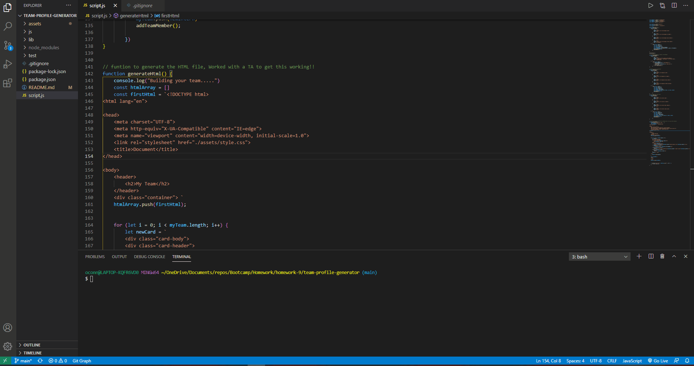

# team-profile-generator

## Description

    This app allows the user to follow prompts and enter information for a full team. Starting with a manager the user has the option to add engineers or interns and the app will compile the information into a static HTML page.

## Installation

    Run node script.js i through the command line to begin the prompts.

## Technologies 

    * JavaScript
    * CSS
    * HTML
    * Node.js
    * Jest
    * Express
    * Inquirer

## Deployment

 * https://github.com/oconnor97/team-profile-generator